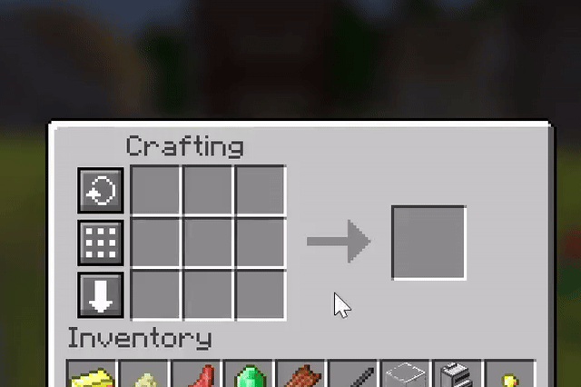
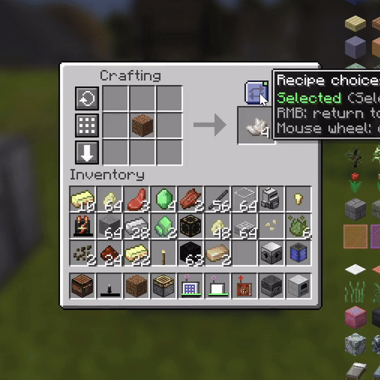
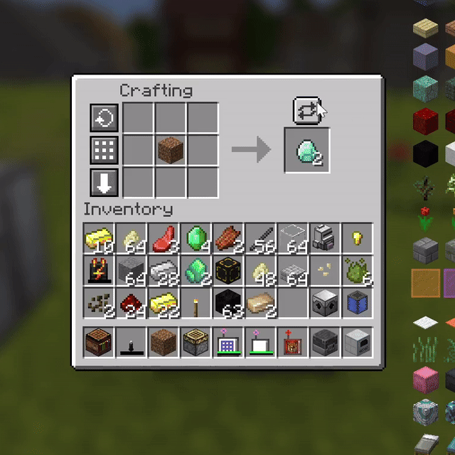
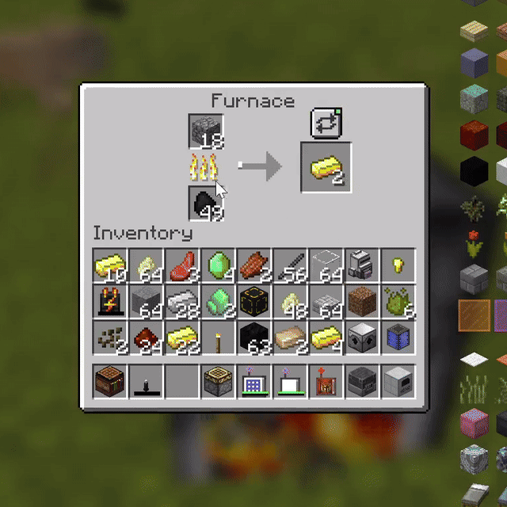

# Retro Polymorph

Retro Polymorph is an unofficial Minecraft 1.12.2 port of
[Polymorph](https://github.com/illusivesoulworks/polymorph) by Illusive Soulworks.
It resolves recipe conflicts when multiple recipes accept the same inputs,
letting every valid result coexist instead of forcing a modpack to remove or
rewrite recipes.

In a large modpack, conflicting recipes are common: the same ingredients may
produce different items from different mods. Retro Polymorph lets the player
choose the intended result and remembers that choice for the next time the
same conflict appears.

## Requirements

- Minecraft 1.12.2
- Forge 14.23.5.2847+
- MixinBooter 11.0+

## Features

### Crafting conflicts

When the current crafting grid matches more than one recipe, a small selector
appears beside the output slot. It only appears for an actual conflict, so
ordinary recipes keep the normal Minecraft experience.



Open the selector to see every available output, then click the result you
want. The crafting output changes immediately.



Your chosen result is remembered. Remove and place the same ingredients again,
and Retro Polymorph restores the previous result automatically.



### Smelting conflicts

Furnaces receive the same recipe-selection UI when one input can produce more
than one valid output. Choose the material you need before collecting the
result.



### More features

- Server-authoritative recipe selection.
- Compact and classic selector layouts with mouse, wheel and keyboard control.
- JEI / HEI recipe-transfer integration.
- Optional FastSuite acceleration with a safe Forge-registry fallback.
- Ordered modpack policy for preferred mods and exact recipes.
- Focused integrations for custom crafting engines instead of unsafe slot guessing.

## Supported integrations

- Vanilla 2x2 / 3x3 crafting and vanilla-style crafting tables
- Vanilla furnaces and furnaces using vanilla `TileEntityFurnace` logic
- Applied Energistics 2: Crafting Terminal, Wireless Crafting Terminal, Pattern Terminal
- Refined Storage: Crafting Grid and regular Pattern Grid
- RFTools / RFTools Control
- Extended Crafting tables and Ender Crafter
- Tinkers' Construct Crafting Station
- Ender IO Crafter
- Thaumcraft 6 Arcane Workbench
- Cyclic Workbench and Auto-Crafter
- IndustrialCraft 2 Batch Crafter and Industrial Workbench
- Mekanism Formulaic Assemblicator (manual mode)
- Thermal Expansion Sequential Fabricator
- Extra Utilities 2 Mechanical / Analog Crafter
- Retro Sophisticated Backpacks Crafting Upgrade
- JEI / HEI transfer and exclusion-area integration

Forestry Worktable and Immersive Engineering Engineer's Workbench are detected
and left to their native recipe-selection UI instead of receiving a duplicate
Retro Polymorph selector.

### Retro Sophisticated Backpacks

The Crafting Upgrade is a focused integration. Retro Polymorph resolves the
active backpack crafting wrapper/output pair and stores the chosen recipe on
that crafting matrix handler. The common `CraftingManager` hook then uses that
recipe when the backpack asks Forge for the matching recipe/result/remainders.
No dedicated RSB mixin is required.

## Usage

When more than one recipe matches the current inputs, a selector button appears
near the result slot.

- Left click: open/close the recipe selector.
- Right click: clear the remembered choice and return to automatic selection.
- Mouse wheel over the button: cycle recipes when enabled.
- Keyboard while open: Left/Right, Home/End, Page Up/Page Down, Enter, 1-9, Esc.

The chosen recipe is remembered for later occurrences of the same conflict when
the integration supports player preferences.

## Configuration

Configuration is stored in `config/retropolymorph.cfg`.

The important policy options are ordered lists: entries near the top have higher
priority.

```ini
policy {
    S:preferredMods <
        thermalfoundation
        mekanism
        *
        minecraft
    >

    S:preferredRecipes <
        enderio:example_recipe
        ic2:another_recipe
    >
}
```

`*` represents every mod not explicitly listed. If omitted, unlisted mods are
placed after the listed entries. Explicit player choices take precedence over
modpack policy.

Integrations can be disabled individually under the `integrations` config
category. Safety guards remain active for custom recipe engines where generic
fallback would be unsafe.

## Addon API

Third-party integrations should register a focused adapter through
`RetroPolymorphAPI` and implement the `RecipeSelectionAdapter.probe(...)`
contract. Use the standard addon priority unless the integration intentionally
replaces a built-in adapter.

```java
RetroPolymorphAPI.registerAdapter(
        new ResourceLocation("examplemod", "custom_table"),
        RetroPolymorphAPI.PRIORITY_NORMAL,
        new ExampleRecipeSelectionAdapter());
```

Custom machine/processing engines can use `registerMachineAdapter(...)`. Recipe
keys must be stable and wire-safe, selection must control the real craft path,
and matching/mutation must remain on the Minecraft server thread.

## Building

```bash
git clone https://github.com/Sosea1/RetroPolymorph.git
cd RetroPolymorph
./gradlew build
```

The compiled JAR is written to `build/libs/`.

## Credits and license

- Illusive Soulworks / TheIllusiveC4 — original Polymorph, concept and inherited UI assets
- Sosea1 — Minecraft 1.12.2 port, integrations and maintenance

Retro Polymorph is an independent, unofficial port and is not affiliated with
or endorsed by Illusive Soulworks. The project is licensed under
**LGPL-3.0-or-later**. See [`LICENSE`](LICENSE) for the complete license text and
asset attribution.
